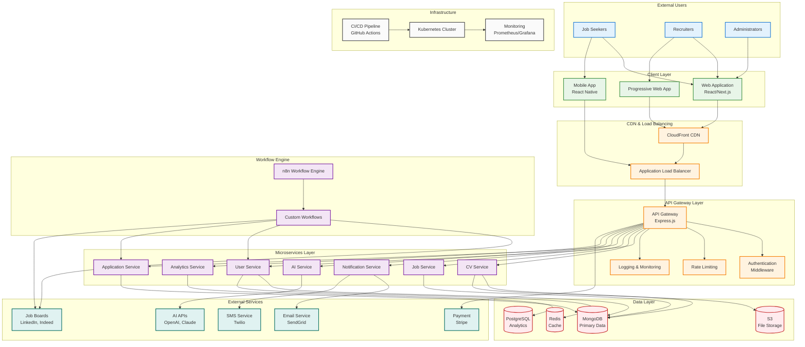
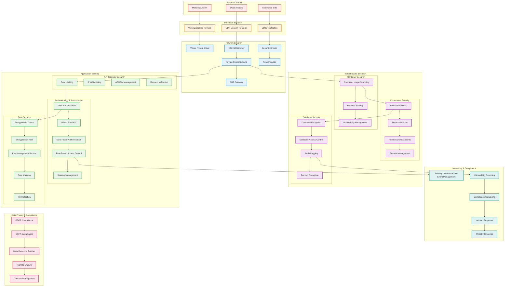

# Architecture Diagrams

## Overview

This document contains comprehensive architecture diagrams for the AI-Powered Job Seeker Platform, showing system structure, component relationships, deployment architecture, and security design.

## Table of Contents
1. [High-Level System Architecture](#high-level-system-architecture)
2. [Microservices Architecture](#microservices-architecture)
3. [Frontend Architecture](#frontend-architecture)
4. [Backend Services Architecture](#backend-services-architecture)
5. [Data Architecture](#data-architecture)
6. [Security Architecture](#security-architecture)
7. [Deployment Architecture](#deployment-architecture)
8. [Network Architecture](#network-architecture)

## High-Level System Architecture

## Microservices Architecture

```mermaid
graph TB
    subgraph "API Gateway"
        AG[API Gateway]
        AUTH_MW[Auth Middleware]
        RATE_MW[Rate Limiting]
        LOG_MW[Logging Middleware]
        CORS_MW[CORS Middleware]
    end
    
    subgraph "Core Services"
        subgraph "User Management"
            US[User Service<br/>:3001]
            PROFILE[Profile Management]
            PREF[User Preferences]
        end
        
        subgraph "CV Management"
            CVS[CV Service<br/>:3002]
            TEMPLATE[Template Engine]
            PDF[PDF Generator]
            PARSER[CV Parser]
        end
        
        subgraph "Job Management"
            JS_SVC[Job Service<br/>:3003]
            SEARCH[Search Engine]
            FILTER[Advanced Filtering]
            GEO[Geolocation Service]
        end
        
        subgraph "Application Processing"
            AS[Application Service<br/>:3004]
            TRACK[Application Tracking]
            STATUS[Status Management]
            INTERVIEW[Interview Scheduling]
        end
    end
    
    subgraph "AI & ML Services"
        AIS[AI Service<br/>:8000]
        ML_MATCH[Job Matching ML]
        NLP[NLP Processing]
        EMBED[Embedding Service]
        CHAT[Conversational AI]
    end
    
    subgraph "Notification Services"
        NS[Notification Service<br/>:3005]
        EMAIL_SVC[Email Service]
        SMS_SVC[SMS Service]
        PUSH_SVC[Push Notifications]
        IN_APP[In-App Notifications]
    end
    
    subgraph "Analytics & Reporting"
        ANS[Analytics Service<br/>:3006]
        METRICS[Metrics Collection]
        REPORTS[Report Generation]
        INSIGHTS[Business Insights]
        DASHBOARD[Dashboard API]
    end
    
    subgraph "Workflow Automation"
        WAS[Workflow Service<br/>:3007]
        AUTO_APPLY[Auto-Apply Engine]
        SCRAPER[Job Scraping]
        SCHEDULER[Task Scheduler]
    end
    
    subgraph "Data Services"
        DS[Data Service<br/>:3008]
        SYNC[Data Synchronization]
        BACKUP[Backup Management]
        MIGRATION[Data Migration]
    end
    
    %% Gateway to Services
    AG --> US
    AG --> CVS
    AG --> JS_SVC
    AG --> AS
    AG --> AIS
    AG --> NS
    AG --> ANS
    AG --> WAS
    AG --> DS
    
    %% Middleware flow
    AG --> AUTH_MW
    AG --> RATE_MW
    AG --> LOG_MW
    AG --> CORS_MW
    
    %% Internal service connections
    US --> PROFILE
    US --> PREF
    CVS --> TEMPLATE
    CVS --> PDF
    CVS --> PARSER
    JS_SVC --> SEARCH
    JS_SVC --> FILTER
    JS_SVC --> GEO
    AS --> TRACK
    AS --> STATUS
    AS --> INTERVIEW
    
    %% AI service components
    AIS --> ML_MATCH
    AIS --> NLP
    AIS --> EMBED
    AIS --> CHAT
    
    %% Notification components
    NS --> EMAIL_SVC
    NS --> SMS_SVC
    NS --> PUSH_SVC
    NS --> IN_APP
    
    %% Analytics components
    ANS --> METRICS
    ANS --> REPORTS
    ANS --> INSIGHTS
    ANS --> DASHBOARD
    
    %% Workflow components
    WAS --> AUTO_APPLY
    WAS --> SCRAPER
    WAS --> SCHEDULER
    
    %% Data service components
    DS --> SYNC
    DS --> BACKUP
    DS --> MIGRATION
    
    %% Inter-service communication
    AS -.-> CVS
    AS -.-> JS_SVC
    ML_MATCH -.-> CVS
    ML_MATCH -.-> JS_SVC
    AUTO_APPLY -.-> AS
    SCRAPER -.-> JS_SVC
    METRICS -.-> US
    METRICS -.-> AS
    
    %% Styling
    classDef gateway fill:#fff3e0,stroke:#f57c00,stroke-width:2px
    classDef service fill:#e8f5e8,stroke:#388e3c,stroke-width:2px
    classDef ai fill:#f3e5f5,stroke:#7b1fa2,stroke-width:2px
    classDef notification fill:#e3f2fd,stroke:#1976d2,stroke-width:2px
    classDef analytics fill:#ffebee,stroke:#c62828,stroke-width:2px
    classDef workflow fill:#e0f2f1,stroke:#00695c,stroke-width:2px
    classDef data fill:#fce4ec,stroke:#ad1457,stroke-width:2px
    classDef middleware fill:#f9f9f9,stroke:#757575,stroke-width:1px
    
    class AG,AUTH_MW,RATE_MW,LOG_MW,CORS_MW gateway
    class US,CVS,JS_SVC,AS,PROFILE,PREF,TEMPLATE,PDF,PARSER,SEARCH,FILTER,GEO,TRACK,STATUS,INTERVIEW service
    class AIS,ML_MATCH,NLP,EMBED,CHAT ai
    class NS,EMAIL_SVC,SMS_SVC,PUSH_SVC,IN_APP notification
    class ANS,METRICS,REPORTS,INSIGHTS,DASHBOARD analytics
    class WAS,AUTO_APPLY,SCRAPER,SCHEDULER workflow
    class DS,SYNC,BACKUP,MIGRATION data
```

## Frontend Architecture

```mermaid
graph TB
    subgraph "Browser/Mobile Environment"
        USER[User Interaction]
    end
    
    subgraph "Frontend Application"
        subgraph "Next.js App Router"
            LAYOUT[Root Layout]
            PAGES[Page Components]
            API_ROUTES[API Routes]
            MIDDLEWARE[Next.js Middleware]
        end
        
        subgraph "React Component Layer"
            subgraph "Page Components"
                HOME[Home Page]
                DASHBOARD[Dashboard]
                JOBS[Jobs Page]
                CV_PAGE[CV Builder]
                PROFILE[Profile Page]
                SETTINGS[Settings]
            end
            
            subgraph "Shared Components"
                HEADER[Header/Navigation]
                FOOTER[Footer]
                SIDEBAR[Sidebar]
                MODALS[Modal Components]
                FORMS[Form Components]
                CARDS[Card Components]
            end
            
            subgraph "Feature Components"
                CV_BUILDER[CV Builder Components]
                JOB_SEARCH[Job Search Components]
                AI_CHAT[AI Chat Interface]
                NOTIFICATIONS[Notification Center]
                ANALYTICS_UI[Analytics Dashboard]
            end
        end
        
        subgraph "State Management"
            REDUX[Redux Store]
            RTK[Redux Toolkit]
            ZUSTAND[Zustand Stores]
            REACT_QUERY[TanStack Query]
        end
        
        subgraph "UI & Styling"
            TAILWIND[Tailwind CSS]
            HEADLESS[Headless UI]
            FRAMER[Framer Motion]
            ICONS[Icon Library]
        end
        
        subgraph "Utilities & Hooks"
            CUSTOM_HOOKS[Custom Hooks]
            UTILS[Utility Functions]
            VALIDATORS[Form Validators]
            FORMATTERS[Data Formatters]
        end
        
        subgraph "API Layer"
            API_CLIENT[API Client]
            AXIOS[Axios Instance]
            INTERCEPTORS[Request/Response Interceptors]
            CACHE[Response Caching]
        end
    end
    
    subgraph "External Services"
        BACKEND_API[Backend APIs]
        CDN[CDN Assets]
        ANALYTICS_EXT[Analytics Services]
        ERROR_TRACK[Error Tracking]
    end
    
    %% User interactions
    USER --> LAYOUT
    
    %% Layout structure
    LAYOUT --> HEADER
    LAYOUT --> PAGES
    LAYOUT --> FOOTER
    
    %% Page to component relationships
    PAGES --> HOME
    PAGES --> DASHBOARD
    PAGES --> JOBS
    PAGES --> CV_PAGE
    PAGES --> PROFILE
    PAGES --> SETTINGS
    
    %% Shared component usage
    HOME --> CARDS
    DASHBOARD --> ANALYTICS_UI
    JOBS --> JOB_SEARCH
    CV_PAGE --> CV_BUILDER
    PROFILE --> FORMS
    SETTINGS --> FORMS
    
    %% Feature component relationships
    CV_BUILDER --> MODALS
    JOB_SEARCH --> CARDS
    AI_CHAT --> NOTIFICATIONS
    
    %% State management flow
    PAGES --> REDUX
    PAGES --> ZUSTAND
    REDUX --> RTK
    API_CLIENT --> REACT_QUERY
    
    %% Styling connections
    PAGES --> TAILWIND
    SHARED --> HEADLESS
    FEATURE --> FRAMER
    UI --> ICONS
    
    %% Utility usage
    FORMS --> VALIDATORS
    ANALYTICS_UI --> FORMATTERS
    API_CLIENT --> CUSTOM_HOOKS
    
    %% API layer
    REACT_QUERY --> API_CLIENT
    API_CLIENT --> AXIOS
    AXIOS --> INTERCEPTORS
    INTERCEPTORS --> CACHE
    
    %% External connections
    API_CLIENT --> BACKEND_API
    LAYOUT --> CDN
    PAGES --> ANALYTICS_EXT
    INTERCEPTORS --> ERROR_TRACK
    
    %% Styling
    classDef user fill:#e3f2fd,stroke:#1976d2,stroke-width:2px
    classDef framework fill:#e8f5e8,stroke:#388e3c,stroke-width:2px
    classDef component fill:#fff3e0,stroke:#f57c00,stroke-width:2px
    classDef state fill:#f3e5f5,stroke:#7b1fa2,stroke-width:2px
    classDef ui fill:#ffebee,stroke:#c62828,stroke-width:2px
    classDef utility fill:#e0f2f1,stroke:#00695c,stroke-width:2px
    classDef api fill:#fce4ec,stroke:#ad1457,stroke-width:2px
    classDef external fill:#f9f9f9,stroke:#757575,stroke-width:2px
    
    class USER user
    class LAYOUT,PAGES,API_ROUTES,MIDDLEWARE framework
    class HOME,DASHBOARD,JOBS,CV_PAGE,PROFILE,SETTINGS,HEADER,FOOTER,SIDEBAR,MODALS,FORMS,CARDS,CV_BUILDER,JOB_SEARCH,AI_CHAT,NOTIFICATIONS,ANALYTICS_UI component
    class REDUX,RTK,ZUSTAND,REACT_QUERY state
    class TAILWIND,HEADLESS,FRAMER,ICONS ui
    class CUSTOM_HOOKS,UTILS,VALIDATORS,FORMATTERS utility
    class API_CLIENT,AXIOS,INTERCEPTORS,CACHE api
    class BACKEND_API,CDN,ANALYTICS_EXT,ERROR_TRACK external
```

## Backend Services Architecture

```mermaid
graph TB
    subgraph "API Gateway Layer"
        AG[API Gateway<br/>Express.js]
        AUTH[Authentication]
        RATE[Rate Limiting]
        PROXY[Service Proxy]
    end
    
    subgraph "Service Mesh"
        SM[Service Mesh<br/>Istio]
        LB[Load Balancing]
        CIRCUIT[Circuit Breaker]
        RETRY[Retry Logic]
    end
    
    subgraph "User Management Service"
        direction TB
        US[User Service]
        subgraph "User Components"
            AUTH_SVC[Authentication Service]
            PROFILE_SVC[Profile Service]
            PREF_SVC[Preferences Service]
            RBAC[Role-Based Access Control]
        end
        subgraph "User Data"
            USER_DB[(User Database)]
            SESSION_CACHE[(Session Cache)]
        end
    end
    
    subgraph "CV Management Service"
        direction TB
        CVS[CV Service]
        subgraph "CV Components"
            CV_CRUD[CV CRUD Operations]
            TEMPLATE_SVC[Template Service]
            PDF_GEN[PDF Generator]
            VERSION[Version Control]
        end
        subgraph "CV Data"
            CV_DB[(CV Database)]
            FILE_STORAGE[(File Storage)]
        end
    end
    
    subgraph "Job Management Service"
        direction TB
        JS_SVC[Job Service]
        subgraph "Job Components"
            JOB_CRUD[Job CRUD Operations]
            SEARCH_SVC[Search Service]
            GEO_SVC[Geolocation Service]
            SCRAPER_SVC[Job Scraper Service]
        end
        subgraph "Job Data"
            JOB_DB[(Job Database)]
            SEARCH_INDEX[(Search Index)]
        end
    end
    
    subgraph "AI Service Layer"
        direction TB
        AIS[AI Service<br/>FastAPI]
        subgraph "AI Components"
            NLP_SVC[NLP Service]
            ML_SVC[ML Service]
            EMBEDDING_SVC[Embedding Service]
            CHAT_SVC[Chat Service]
        end
        subgraph "AI Data"
            MODEL_STORE[(Model Store)]
            VECTOR_DB[(Vector Database)]
        end
    end
    
    subgraph "Message Queue System"
        MQ[Message Queue<br/>Redis]
        EVENTS[Event Bus]
        WORKERS[Background Workers]
    end
    
    subgraph "Monitoring & Observability"
        METRICS[Metrics Collection]
        LOGS[Centralized Logging]
        TRACES[Distributed Tracing]
        ALERTS[Alerting System]
    end
    
    %% API Gateway connections
    AG --> AUTH
    AG --> RATE
    AG --> PROXY
    
    %% Service mesh connections
    PROXY --> SM
    SM --> LB
    SM --> CIRCUIT
    SM --> RETRY
    
    %% Service routing
    LB --> US
    LB --> CVS
    LB --> JS_SVC
    LB --> AIS
    
    %% User service internal
    US --> AUTH_SVC
    US --> PROFILE_SVC
    US --> PREF_SVC
    US --> RBAC
    AUTH_SVC --> USER_DB
    PROFILE_SVC --> USER_DB
    RBAC --> SESSION_CACHE
    
    %% CV service internal
    CVS --> CV_CRUD
    CVS --> TEMPLATE_SVC
    CVS --> PDF_GEN
    CVS --> VERSION
    CV_CRUD --> CV_DB
    PDF_GEN --> FILE_STORAGE
    
    %% Job service internal
    JS_SVC --> JOB_CRUD
    JS_SVC --> SEARCH_SVC
    JS_SVC --> GEO_SVC
    JS_SVC --> SCRAPER_SVC
    JOB_CRUD --> JOB_DB
    SEARCH_SVC --> SEARCH_INDEX
    
    %% AI service internal
    AIS --> NLP_SVC
    AIS --> ML_SVC
    AIS --> EMBEDDING_SVC
    AIS --> CHAT_SVC
    ML_SVC --> MODEL_STORE
    EMBEDDING_SVC --> VECTOR_DB
    
    %% Message queue connections
    US --> MQ
    CVS --> MQ
    JS_SVC --> MQ
    AIS --> MQ
    MQ --> EVENTS
    EVENTS --> WORKERS
    
    %% Monitoring connections
    US --> METRICS
    CVS --> LOGS
    JS_SVC --> TRACES
    AIS --> ALERTS
    
    %% Inter-service communication
    AIS -.-> CVS
    AIS -.-> JS_SVC
    CVS -.-> US
    JS_SVC -.-> US
    
    %% Styling
    classDef gateway fill:#fff3e0,stroke:#f57c00,stroke-width:2px
    classDef mesh fill:#e3f2fd,stroke:#1976d2,stroke-width:2px
    classDef service fill:#e8f5e8,stroke:#388e3c,stroke-width:2px
    classDef ai fill:#f3e5f5,stroke:#7b1fa2,stroke-width:2px
    classDef data fill:#ffebee,stroke:#c62828,stroke-width:2px
    classDef queue fill:#e0f2f1,stroke:#00695c,stroke-width:2px
    classDef monitoring fill:#fce4ec,stroke:#ad1457,stroke-width:2px
    
    class AG,AUTH,RATE,PROXY gateway
    class SM,LB,CIRCUIT,RETRY mesh
    class US,CVS,JS_SVC,AUTH_SVC,PROFILE_SVC,PREF_SVC,RBAC,CV_CRUD,TEMPLATE_SVC,PDF_GEN,VERSION,JOB_CRUD,SEARCH_SVC,GEO_SVC,SCRAPER_SVC service
    class AIS,NLP_SVC,ML_SVC,EMBEDDING_SVC,CHAT_SVC ai
    class USER_DB,SESSION_CACHE,CV_DB,FILE_STORAGE,JOB_DB,SEARCH_INDEX,MODEL_STORE,VECTOR_DB data
    class MQ,EVENTS,WORKERS queue
    class METRICS,LOGS,TRACES,ALERTS monitoring
```

## Data Architecture

```mermaid
graph TB
    subgraph "Application Layer"
        WEB[Web Application]
        API[API Services]
        WORKER[Background Workers]
    end
    
    subgraph "Data Access Layer"
        ORM[ORM/ODM<br/>Mongoose, Prisma]
        QUERY[Query Builder]
        CONN[Connection Pool]
        CACHE_LAYER[Cache Layer]
    end
    
    subgraph "Primary Storage"
        subgraph "MongoDB Cluster"
            MONGO_PRIMARY[(MongoDB Primary)]
            MONGO_SECONDARY[(MongoDB Secondary)]
            MONGO_ARBITER[(MongoDB Arbiter)]
        end
        
        subgraph "MongoDB Collections"
            USERS_COLL[Users Collection]
            CVS_COLL[CVs Collection]
            JOBS_COLL[Jobs Collection]
            APPS_COLL[Applications Collection]
            COMPANIES_COLL[Companies Collection]
        end
    end
    
    subgraph "Analytics Storage"
        subgraph "PostgreSQL Cluster"
            PG_PRIMARY[(PostgreSQL Primary)]
            PG_REPLICA[(PostgreSQL Read Replica)]
        end
        
        subgraph "Analytics Tables"
            USER_EVENTS[User Events]
            JOB_ANALYTICS[Job Analytics]
            APP_ANALYTICS[Application Analytics]
            SEARCH_ANALYTICS[Search Analytics]
            AI_METRICS[AI Metrics]
        end
    end
    
    subgraph "Caching Layer"
        subgraph "Redis Cluster"
            REDIS_MASTER[(Redis Master)]
            REDIS_SLAVE[(Redis Slave)]
        end
        
        subgraph "Cache Types"
            SESSION_CACHE[Session Cache]
            API_CACHE[API Response Cache]
            QUERY_CACHE[Query Result Cache]
            JOB_QUEUE[Job Queue]
        end
    end
    
    subgraph "File Storage"
        subgraph "AWS S3"
            CV_BUCKET[CV Documents Bucket]
            ASSET_BUCKET[Assets Bucket]
            BACKUP_BUCKET[Backup Bucket]
        end
        
        subgraph "CDN"
            CLOUDFRONT[CloudFront CDN]
        end
    end
    
    subgraph "Search & Analytics"
        ELASTICSEARCH[(Elasticsearch)]
        KIBANA[Kibana Dashboard]
        LOGSTASH[Logstash]
    end
    
    subgraph "Vector Database"
        CHROMA[(ChromaDB)]
        EMBEDDINGS[Job/CV Embeddings]
        SIMILARITY[Similarity Search]
    end
    
    subgraph "Data Pipeline"
        ETL[ETL Processes]
        STREAM[Stream Processing]
        BATCH[Batch Processing]
        SCHEDULER[Data Scheduler]
    end
    
    subgraph "Backup & Recovery"
        MONGO_BACKUP[MongoDB Backup]
        PG_BACKUP[PostgreSQL Backup]
        SNAPSHOT[S3 Snapshots]
        DISASTER_RECOVERY[Disaster Recovery]
    end
    
    %% Application to Data Access
    WEB --> ORM
    API --> ORM
    WORKER --> QUERY
    ORM --> CONN
    QUERY --> CACHE_LAYER
    
    %% Data Access to Storage
    CONN --> MONGO_PRIMARY
    CONN --> PG_PRIMARY
    CACHE_LAYER --> REDIS_MASTER
    
    %% MongoDB replication
    MONGO_PRIMARY --> MONGO_SECONDARY
    MONGO_PRIMARY --> MONGO_ARBITER
    
    %% MongoDB collections
    MONGO_PRIMARY --> USERS_COLL
    MONGO_PRIMARY --> CVS_COLL
    MONGO_PRIMARY --> JOBS_COLL
    MONGO_PRIMARY --> APPS_COLL
    MONGO_PRIMARY --> COMPANIES_COLL
    
    %% PostgreSQL replication
    PG_PRIMARY --> PG_REPLICA
    
    %% Analytics tables
    PG_PRIMARY --> USER_EVENTS
    PG_PRIMARY --> JOB_ANALYTICS
    PG_PRIMARY --> APP_ANALYTICS
    PG_PRIMARY --> SEARCH_ANALYTICS
    PG_PRIMARY --> AI_METRICS
    
    %% Redis replication
    REDIS_MASTER --> REDIS_SLAVE
    
    %% Cache types
    REDIS_MASTER --> SESSION_CACHE
    REDIS_MASTER --> API_CACHE
    REDIS_MASTER --> QUERY_CACHE
    REDIS_MASTER --> JOB_QUEUE
    
    %% File storage
    API --> CV_BUCKET
    API --> ASSET_BUCKET
    CV_BUCKET --> CLOUDFRONT
    ASSET_BUCKET --> CLOUDFRONT
    
    %% Search and analytics
    MONGO_PRIMARY --> ELASTICSEARCH
    PG_PRIMARY --> LOGSTASH
    LOGSTASH --> ELASTICSEARCH
    ELASTICSEARCH --> KIBANA
    
    %% Vector database
    API --> CHROMA
    CHROMA --> EMBEDDINGS
    CHROMA --> SIMILARITY
    
    %% Data pipeline
    MONGO_PRIMARY --> ETL
    PG_PRIMARY --> STREAM
    ETL --> BATCH
    BATCH --> SCHEDULER
    
    %% Backup and recovery
    MONGO_PRIMARY --> MONGO_BACKUP
    PG_PRIMARY --> PG_BACKUP
    CV_BUCKET --> SNAPSHOT
    MONGO_BACKUP --> DISASTER_RECOVERY
    
    %% Styling
    classDef app fill:#e3f2fd,stroke:#1976d2,stroke-width:2px
    classDef access fill:#fff3e0,stroke:#f57c00,stroke-width:2px
    classDef primary fill:#e8f5e8,stroke:#388e3c,stroke-width:2px
    classDef analytics fill:#f3e5f5,stroke:#7b1fa2,stroke-width:2px
    classDef cache fill:#ffebee,stroke:#c62828,stroke-width:2px
    classDef storage fill:#e0f2f1,stroke:#00695c,stroke-width:2px
    classDef search fill:#fce4ec,stroke:#ad1457,stroke-width:2px
    classDef vector fill:#e8eaf6,stroke:#3f51b5,stroke-width:2px
    classDef pipeline fill:#f9f9f9,stroke:#757575,stroke-width:2px
    
    class WEB,API,WORKER app
    class ORM,QUERY,CONN,CACHE_LAYER access
    class MONGO_PRIMARY,MONGO_SECONDARY,MONGO_ARBITER,USERS_COLL,CVS_COLL,JOBS_COLL,APPS_COLL,COMPANIES_COLL primary
    class PG_PRIMARY,PG_REPLICA,USER_EVENTS,JOB_ANALYTICS,APP_ANALYTICS,SEARCH_ANALYTICS,AI_METRICS analytics
    class REDIS_MASTER,REDIS_SLAVE,SESSION_CACHE,API_CACHE,QUERY_CACHE,JOB_QUEUE cache
    class CV_BUCKET,ASSET_BUCKET,BACKUP_BUCKET,CLOUDFRONT storage
    class ELASTICSEARCH,KIBANA,LOGSTASH search
    class CHROMA,EMBEDDINGS,SIMILARITY vector
    class ETL,STREAM,BATCH,SCHEDULER,MONGO_BACKUP,PG_BACKUP,SNAPSHOT,DISASTER_RECOVERY pipeline
```

## Security Architecture

## Deployment Architecture

```mermaid
graph TB
    subgraph "Multi-Cloud Infrastructure"
        subgraph "AWS (Primary)"
            subgraph "Production Environment"
                AWS_PROD_VPC[Production VPC]
                AWS_EKS_PROD[EKS Cluster - Production]
                AWS_RDS_PROD[RDS - Production]
                AWS_S3_PROD[S3 - Production]
                AWS_REDIS_PROD[ElastiCache - Production]
            end
            
            subgraph "Staging Environment"
                AWS_STAGING_VPC[Staging VPC]
                AWS_EKS_STAGING[EKS Cluster - Staging]
                AWS_RDS_STAGING[RDS - Staging]
                AWS_S3_STAGING[S3 - Staging]
            end
            
            subgraph "Development Environment"
                AWS_DEV_VPC[Development VPC]
                AWS_EKS_DEV[EKS Cluster - Development]
                AWS_RDS_DEV[RDS - Development]
            end
        end
        
        subgraph "GCP (Disaster Recovery)"
            GCP_VPC[GCP VPC]
            GKE_DR[GKE Cluster - DR]
            CLOUD_SQL_DR[Cloud SQL - DR]
            GCS_DR[Cloud Storage - DR]
        end
    end
    
    subgraph "Container Orchestration"
        subgraph "Kubernetes Production"
            K8S_INGRESS[Ingress Controller]
            K8S_SERVICES[Kubernetes Services]
            K8S_DEPLOYMENTS[Application Deployments]
            K8S_CONFIGS[ConfigMaps & Secrets]
            K8S_STORAGE[Persistent Volumes]
        end
        
        subgraph "Service Mesh"
            ISTIO[Istio Service Mesh]
            ENVOY[Envoy Proxies]
            CIRCUIT_BREAKER[Circuit Breakers]
            LOAD_BALANCER[Load Balancing]
        end
    end
    
    subgraph "CI/CD Pipeline"
        subgraph "Source Control"
            GITHUB[GitHub Repository]
            FEATURE_BRANCHES[Feature Branches]
            MAIN_BRANCH[Main Branch]
        end
        
        subgraph "Build Pipeline"
            GITHUB_ACTIONS[GitHub Actions]
            BUILD_STAGE[Build & Test]
            SECURITY_SCAN[Security Scanning]
            IMAGE_BUILD[Container Image Build]
            IMAGE_REGISTRY[Container Registry]
        end
        
        subgraph "Deployment Pipeline"
            HELM[Helm Charts]
            ARGOCD[ArgoCD]
            CANARY[Canary Deployments]
            BLUE_GREEN[Blue-Green Deployments]
        end
    end
    
    subgraph "Monitoring & Observability"
        subgraph "Metrics & Monitoring"
            PROMETHEUS[Prometheus]
            GRAFANA[Grafana Dashboards]
            ALERTMANAGER[Alert Manager]
        end
        
        subgraph "Logging"
            FLUENTD[Fluentd]
            ELASTICSEARCH_LOG[Elasticsearch]
            KIBANA_LOG[Kibana]
        end
        
        subgraph "Tracing"
            JAEGER[Jaeger Tracing]
            ZIPKIN[Zipkin]
        end
        
        subgraph "Error Tracking"
            SENTRY[Sentry]
            ERROR_ALERTING[Error Alerting]
        end
    end
    
    subgraph "Traffic Management"
        subgraph "Global Load Balancing"
            CLOUDFLARE[Cloudflare]
            CDN_EDGE[Edge Locations]
            WAF_GLOBAL[Global WAF]
        end
        
        subgraph "Regional Load Balancing"
            ALB_AWS[AWS Application LB]
            NLB_AWS[AWS Network LB]
            GLB_GCP[GCP Global LB]
        end
    end
    
    subgraph "Security & Compliance"
        subgraph "Certificate Management"
            CERT_MANAGER[Cert Manager]
            SSL_CERTS[SSL Certificates]
            AUTO_RENEWAL[Auto Renewal]
        end
        
        subgraph "Secrets Management"
            AWS_SECRETS[AWS Secrets Manager]
            K8S_SECRETS[Kubernetes Secrets]
            VAULT[HashiCorp Vault]
        end
        
        subgraph "Security Scanning"
            CONTAINER_SCAN[Container Scanning]
            VULNERABILITY_SCAN_DEPLOY[Vulnerability Scanning]
            COMPLIANCE_CHECK[Compliance Checking]
        end
    end
    
    %% Infrastructure connections
    AWS_EKS_PROD --> K8S_SERVICES
    AWS_EKS_STAGING --> K8S_SERVICES
    GKE_DR --> K8S_SERVICES
    
    %% Container orchestration
    K8S_INGRESS --> K8S_SERVICES
    K8S_SERVICES --> K8S_DEPLOYMENTS
    K8S_DEPLOYMENTS --> K8S_CONFIGS
    K8S_DEPLOYMENTS --> K8S_STORAGE
    
    %% Service mesh
    K8S_SERVICES --> ISTIO
    ISTIO --> ENVOY
    ENVOY --> CIRCUIT_BREAKER
    CIRCUIT_BREAKER --> LOAD_BALANCER
    
    %% CI/CD flow
    FEATURE_BRANCHES --> MAIN_BRANCH
    MAIN_BRANCH --> GITHUB_ACTIONS
    GITHUB_ACTIONS --> BUILD_STAGE
    BUILD_STAGE --> SECURITY_SCAN
    SECURITY_SCAN --> IMAGE_BUILD
    IMAGE_BUILD --> IMAGE_REGISTRY
    IMAGE_REGISTRY --> HELM
    HELM --> ARGOCD
    ARGOCD --> CANARY
    CANARY --> BLUE_GREEN
    
    %% Deployment targets
    ARGOCD --> AWS_EKS_PROD
    ARGOCD --> AWS_EKS_STAGING
    ARGOCD --> GKE_DR
    
    %% Monitoring connections
    K8S_DEPLOYMENTS --> PROMETHEUS
    PROMETHEUS --> GRAFANA
    PROMETHEUS --> ALERTMANAGER
    K8S_DEPLOYMENTS --> FLUENTD
    FLUENTD --> ELASTICSEARCH_LOG
    ELASTICSEARCH_LOG --> KIBANA_LOG
    K8S_DEPLOYMENTS --> JAEGER
    K8S_DEPLOYMENTS --> SENTRY
    
    %% Traffic management
    CLOUDFLARE --> CDN_EDGE
    CDN_EDGE --> ALB_AWS
    ALB_AWS --> K8S_INGRESS
    GLB_GCP --> GKE_DR
    
    %% Security
    K8S_CONFIGS --> CERT_MANAGER
    CERT_MANAGER --> SSL_CERTS
    K8S_SECRETS --> AWS_SECRETS
    AWS_SECRETS --> VAULT
    IMAGE_BUILD --> CONTAINER_SCAN
    
    %% Styling
    classDef aws fill:#ff9900,stroke:#232f3e,stroke-width:2px,color:#fff
    classDef gcp fill:#4285f4,stroke:#1a73e8,stroke-width:2px,color:#fff
    classDef k8s fill:#326ce5,stroke:#ffffff,stroke-width:2px,color:#fff
    classDef cicd fill:#28a745,stroke:#1e7e34,stroke-width:2px,color:#fff
    classDef monitoring fill:#dc3545,stroke:#c82333,stroke-width:2px,color:#fff
    classDef traffic fill:#17a2b8,stroke:#138496,stroke-width:2px,color:#fff
    classDef security fill:#6f42c1,stroke:#59359a,stroke-width:2px,color:#fff
    
    class AWS_PROD_VPC,AWS_EKS_PROD,AWS_RDS_PROD,AWS_S3_PROD,AWS_REDIS_PROD,AWS_STAGING_VPC,AWS_EKS_STAGING,AWS_RDS_STAGING,AWS_S3_STAGING,AWS_DEV_VPC,AWS_EKS_DEV,AWS_RDS_DEV,ALB_AWS,NLB_AWS,AWS_SECRETS aws
    class GCP_VPC,GKE_DR,CLOUD_SQL_DR,GCS_DR,GLB_GCP gcp
    class K8S_INGRESS,K8S_SERVICES,K8S_DEPLOYMENTS,K8S_CONFIGS,K8S_STORAGE,ISTIO,ENVOY,CIRCUIT_BREAKER,LOAD_BALANCER k8s
    class GITHUB,FEATURE_BRANCHES,MAIN_BRANCH,GITHUB_ACTIONS,BUILD_STAGE,SECURITY_SCAN,IMAGE_BUILD,IMAGE_REGISTRY,HELM,ARGOCD,CANARY,BLUE_GREEN cicd
    class PROMETHEUS,GRAFANA,ALERTMANAGER,FLUENTD,ELASTICSEARCH_LOG,KIBANA_LOG,JAEGER,ZIPKIN,SENTRY,ERROR_ALERTING monitoring
    class CLOUDFLARE,CDN_EDGE,WAF_GLOBAL traffic
    class CERT_MANAGER,SSL_CERTS,AUTO_RENEWAL,K8S_SECRETS,VAULT,CONTAINER_SCAN,VULNERABILITY_SCAN_DEPLOY,COMPLIANCE_CHECK security
```

## Network Architecture

```mermaid
graph TB
    subgraph "Internet"
        USERS[End Users]
        INTERNET[Internet]
    end
    
    subgraph "Edge & CDN Layer"
        CLOUDFLARE[Cloudflare Global Network]
        EDGE_LOCATIONS[Edge Locations Worldwide]
        WAF_EDGE[Edge WAF]
        DDOS_PROTECTION[DDoS Protection]
    end
    
    subgraph "AWS Primary Region (us-east-1)"
        subgraph "Production VPC (10.0.0.0/16)"
            subgraph "Public Subnets"
                PUBLIC_1A[Public Subnet AZ-1a<br/>10.0.1.0/24]
                PUBLIC_1B[Public Subnet AZ-1b<br/>10.0.2.0/24]
                PUBLIC_1C[Public Subnet AZ-1c<br/>10.0.3.0/24]
                
                ALB[Application Load Balancer]
                NAT_1A[NAT Gateway AZ-1a]
                NAT_1B[NAT Gateway AZ-1b]
                NAT_1C[NAT Gateway AZ-1c]
            end
            
            subgraph "Private Subnets - App Tier"
                PRIVATE_APP_1A[Private App AZ-1a<br/>10.0.11.0/24]
                PRIVATE_APP_1B[Private App AZ-1b<br/>10.0.12.0/24]
                PRIVATE_APP_1C[Private App AZ-1c<br/>10.0.13.0/24]
                
                EKS_NODES[EKS Worker Nodes]
                APP_SERVERS[Application Servers]
            end
            
            subgraph "Private Subnets - Data Tier"
                PRIVATE_DB_1A[Private DB AZ-1a<br/>10.0.21.0/24]
                PRIVATE_DB_1B[Private DB AZ-1b<br/>10.0.22.0/24]
                PRIVATE_DB_1C[Private DB AZ-1c<br/>10.0.23.0/24]
                
                RDS_CLUSTER[RDS MongoDB Cluster]
                REDIS_CLUSTER[ElastiCache Redis]
            end
            
            IGW[Internet Gateway]
            VPC_ENDPOINT[VPC Endpoints]
        end
        
        subgraph "Staging VPC (10.1.0.0/16)"
            STAGING_SUBNETS[Staging Subnets]
            STAGING_EKS[Staging EKS]
            STAGING_DB[Staging Databases]
        end
    end
    
    subgraph "AWS Secondary Region (us-west-2)"
        subgraph "DR VPC (10.2.0.0/16)"
            DR_SUBNETS[DR Subnets]
            DR_EKS[DR EKS Cluster]
            DR_DB[DR Databases]
        end
    end
    
    subgraph "GCP Region (us-central1)"
        subgraph "GCP VPC (10.3.0.0/16)"
            GCP_SUBNETS[GCP Subnets]
            GKE_CLUSTER[GKE Cluster]
            CLOUD_SQL[Cloud SQL]
        end
    end
    
    subgraph "Network Security"
        subgraph "Security Groups"
            WEB_SG[Web Security Group<br/>Port 80, 443]
            APP_SG[App Security Group<br/>Port 3000-8000]
            DB_SG[DB Security Group<br/>Port 27017, 5432, 6379]
        end
        
        subgraph "Network ACLs"
            PUBLIC_NACL[Public Subnet NACL]
            PRIVATE_NACL[Private Subnet NACL]
        end
        
        subgraph "VPN & Private Connectivity"
            VPN_GW[VPN Gateway]
            DIRECT_CONNECT[AWS Direct Connect]
            PRIVATE_LINK[AWS PrivateLink]
        end
    end
    
    subgraph "Service Mesh Networking"
        ISTIO_INGRESS[Istio Ingress Gateway]
        ISTIO_EGRESS[Istio Egress Gateway]
        SIDECAR_PROXIES[Envoy Sidecar Proxies]
        MESH_POLICIES[Network Policies]
    end
    
    subgraph "DNS & Service Discovery"
        ROUTE53[Route 53]
        PRIVATE_DNS[Private DNS Zones]
        SERVICE_DISCOVERY[Kubernetes Service Discovery]
        CONSUL[Consul Service Mesh]
    end
    
    subgraph "Monitoring & Observability"
        NETWORK_MONITORING[Network Monitoring]
        FLOW_LOGS[VPC Flow Logs]
        TRAFFIC_ANALYSIS[Traffic Analysis]
        LATENCY_MONITORING[Latency Monitoring]
    end
    
    %% User traffic flow
    USERS --> INTERNET
    INTERNET --> CLOUDFLARE
    CLOUDFLARE --> EDGE_LOCATIONS
    EDGE_LOCATIONS --> WAF_EDGE
    WAF_EDGE --> DDOS_PROTECTION
    
    %% Edge to AWS
    DDOS_PROTECTION --> IGW
    IGW --> ALB
    ALB --> PUBLIC_1A
    ALB --> PUBLIC_1B
    ALB --> PUBLIC_1C
    
    %% Public to Private routing
    PUBLIC_1A --> NAT_1A
    PUBLIC_1B --> NAT_1B
    PUBLIC_1C --> NAT_1C
    
    NAT_1A --> PRIVATE_APP_1A
    NAT_1B --> PRIVATE_APP_1B
    NAT_1C --> PRIVATE_APP_1C
    
    %% App to Data tier
    PRIVATE_APP_1A --> PRIVATE_DB_1A
    PRIVATE_APP_1B --> PRIVATE_DB_1B
    PRIVATE_APP_1C --> PRIVATE_DB_1C
    
    %% EKS and databases
    PRIVATE_APP_1A --> EKS_NODES
    PRIVATE_APP_1B --> APP_SERVERS
    PRIVATE_DB_1A --> RDS_CLUSTER
    PRIVATE_DB_1B --> REDIS_CLUSTER
    
    %% Security group assignments
    ALB --> WEB_SG
    EKS_NODES --> APP_SG
    RDS_CLUSTER --> DB_SG
    
    %% Network ACLs
    PUBLIC_1A --> PUBLIC_NACL
    PRIVATE_APP_1A --> PRIVATE_NACL
    
    %% Cross-region connectivity
    RDS_CLUSTER -.-> DR_DB
    EKS_NODES -.-> DR_EKS
    
    %% Multi-cloud connectivity
    DR_EKS -.-> GKE_CLUSTER
    DR_DB -.-> CLOUD_SQL
    
    %% Service mesh
    EKS_NODES --> ISTIO_INGRESS
    ISTIO_INGRESS --> SIDECAR_PROXIES
    SIDECAR_PROXIES --> ISTIO_EGRESS
    
    %% DNS and service discovery
    ALB --> ROUTE53
    EKS_NODES --> SERVICE_DISCOVERY
    SERVICE_DISCOVERY --> CONSUL
    
    %% VPC endpoints
    PRIVATE_APP_1A --> VPC_ENDPOINT
    VPC_ENDPOINT --> PRIVATE_LINK
    
    %% Monitoring
    EKS_NODES --> NETWORK_MONITORING
    ALB --> FLOW_LOGS
    SIDECAR_PROXIES --> TRAFFIC_ANALYSIS
    
    %% Styling
    classDef internet fill:#e3f2fd,stroke:#1976d2,stroke-width:2px
    classDef edge fill:#fff3e0,stroke:#f57c00,stroke-width:2px
    classDef public fill:#e8f5e8,stroke:#388e3c,stroke-width:2px
    classDef private fill:#f3e5f5,stroke:#7b1fa2,stroke-width:2px
    classDef database fill:#ffebee,stroke:#c62828,stroke-width:2px
    classDef security fill:#e0f2f1,stroke:#00695c,stroke-width:2px
    classDef mesh fill:#fce4ec,stroke:#ad1457,stroke-width:2px
    classDef monitoring fill:#f9f9f9,stroke:#757575,stroke-width:2px
    
    class USERS,INTERNET internet
    class CLOUDFLARE,EDGE_LOCATIONS,WAF_EDGE,DDOS_PROTECTION edge
    class PUBLIC_1A,PUBLIC_1B,PUBLIC_1C,ALB,NAT_1A,NAT_1B,NAT_1C,IGW public
    class PRIVATE_APP_1A,PRIVATE_APP_1B,PRIVATE_APP_1C,EKS_NODES,APP_SERVERS private
    class PRIVATE_DB_1A,PRIVATE_DB_1B,PRIVATE_DB_1C,RDS_CLUSTER,REDIS_CLUSTER database
    class WEB_SG,APP_SG,DB_SG,PUBLIC_NACL,PRIVATE_NACL,VPN_GW,DIRECT_CONNECT,PRIVATE_LINK security
    class ISTIO_INGRESS,ISTIO_EGRESS,SIDECAR_PROXIES,MESH_POLICIES,ROUTE53,SERVICE_DISCOVERY,CONSUL mesh
    class NETWORK_MONITORING,FLOW_LOGS,TRAFFIC_ANALYSIS,LATENCY_MONITORING monitoring
```

This comprehensive architecture documentation provides detailed visual representations of the AI-Powered Job Seeker Platform's system design, covering all aspects from high-level architecture to detailed network topology, enabling proper understanding, implementation, and maintenance of the platform.
