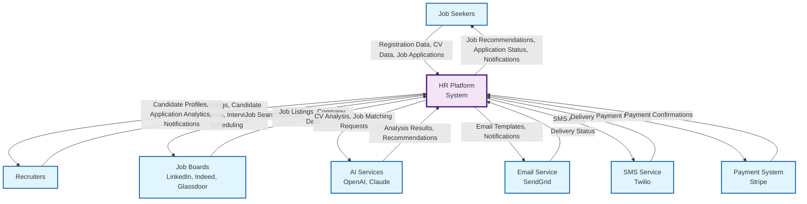
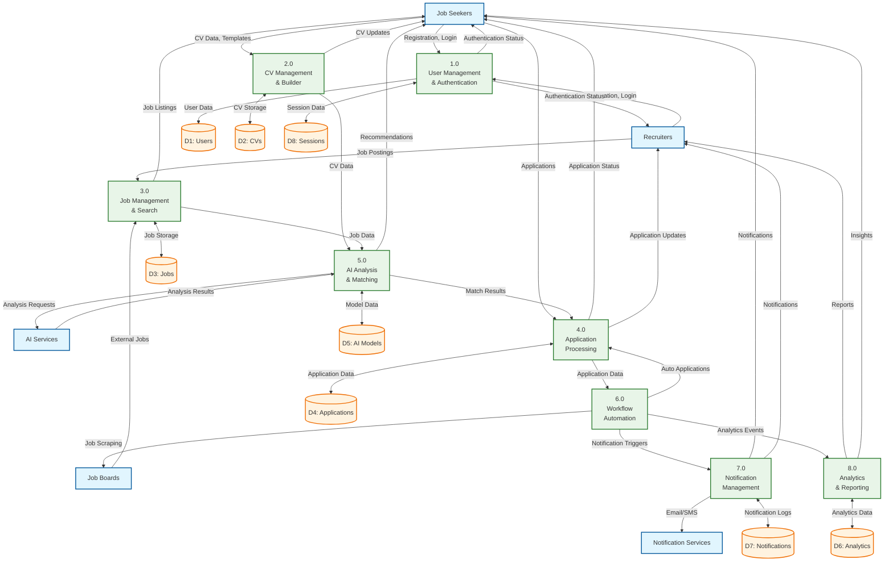
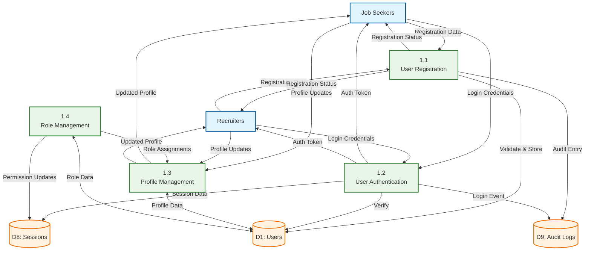
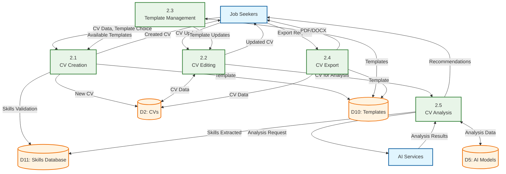
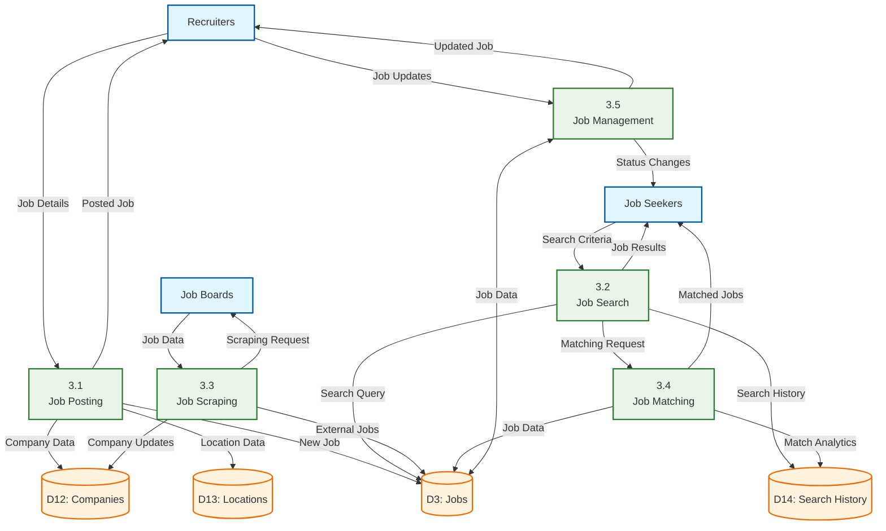
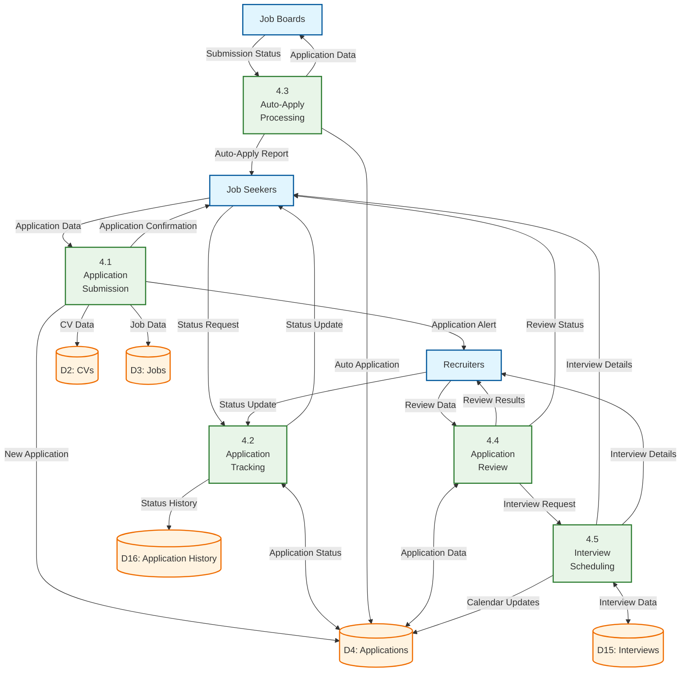
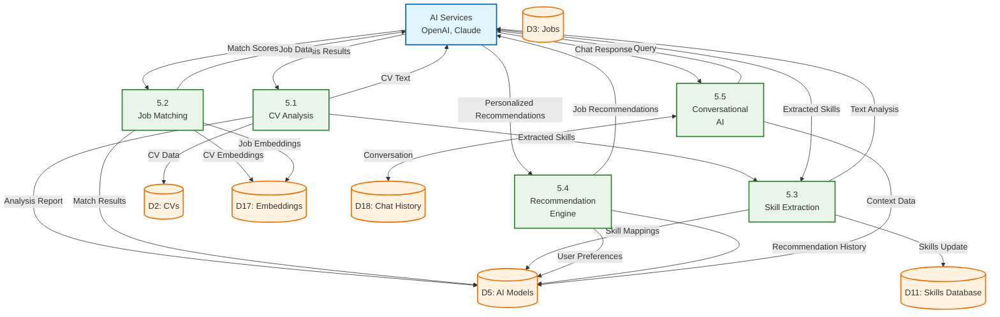

# Data Flow Diagrams (DFD)

## Overview

This document contains comprehensive Data Flow Diagrams for the AI-Powered Job Seeker Platform, showing how data moves through the system at different levels of detail.

## Table of Contents
1. [Context Diagram (Level 0)](#context-diagram-level-0)
2. [System Overview Diagram (Level 1)](#system-overview-diagram-level-1)
3. [Detailed Process Diagrams (Level 2)](#detailed-process-diagrams-level-2)
4. [Data Dictionary](#data-dictionary)

## Context Diagram (Level 0)

The context diagram shows the system as a single process with external entities and data flows.

## System Overview Diagram (Level 1)

The Level 1 DFD breaks down the main system into major processes and data stores.

## Detailed Process Diagrams (Level 2)

### 2.1 User Management & Authentication (Process 1.0)

### 2.2 CV Management & Builder (Process 2.0)

### 2.3 Job Management & Search (Process 3.0)

### 2.4 Application Processing (Process 4.0)

### 2.5 AI Analysis & Matching (Process 5.0)

## Data Dictionary

### Data Stores

| ID | Name | Description | Data Elements |
|----|------|-------------|---------------|
| D1 | Users | User account information | user_id, email, password_hash, profile_data, role, created_at, updated_at |
| D2 | CVs | Resume/CV documents and data | cv_id, user_id, title, sections, template_id, version, created_at |
| D3 | Jobs | Job postings and listings | job_id, title, company, description, requirements, location, salary, posted_at |
| D4 | Applications | Job applications and status | app_id, user_id, job_id, cv_id, status, applied_at, updated_at |
| D5 | AI Models | AI analysis data and models | model_id, type, data, embeddings, created_at, updated_at |
| D6 | Analytics | System analytics and metrics | event_id, user_id, event_type, data, timestamp |
| D7 | Notifications | Notification logs and templates | notif_id, user_id, type, content, status, sent_at |
| D8 | Sessions | User session data | session_id, user_id, token, expires_at, created_at |
| D9 | Audit Logs | System audit trail | log_id, user_id, action, details, timestamp |
| D10 | Templates | CV templates | template_id, name, structure, preview, created_at |
| D11 | Skills Database | Skills and competencies | skill_id, name, category, synonyms, level |
| D12 | Companies | Company information | company_id, name, description, industry, location |
| D13 | Locations | Geographic locations | location_id, city, state, country, coordinates |
| D14 | Search History | User search patterns | search_id, user_id, query, filters, timestamp |
| D15 | Interviews | Interview scheduling | interview_id, app_id, datetime, type, status |
| D16 | Application History | Application status history | history_id, app_id, old_status, new_status, timestamp |
| D17 | Embeddings | Vector embeddings for ML | embedding_id, entity_type, entity_id, vector_data |
| D18 | Chat History | AI conversation history | chat_id, user_id, message, response, timestamp |

### Data Flows

| Flow | Description | Data Elements |
|------|-------------|---------------|
| Registration Data | User signup information | email, password, name, role, preferences |
| Login Credentials | Authentication data | email/username, password, 2FA_code |
| CV Data | Resume information | personal_info, experience, education, skills, achievements |
| Job Posting | Job creation data | title, description, requirements, company, location, salary |
| Application Data | Job application info | job_id, cv_id, cover_letter, additional_documents |
| Search Criteria | Job search parameters | keywords, location, salary_range, job_type, experience_level |
| Analysis Results | AI analysis output | scores, recommendations, extracted_data, confidence_levels |
| Notification Data | Alert information | recipient, type, content, priority, delivery_method |

### External Entities

| Entity | Description | Data In | Data Out |
|--------|-------------|---------|-----------|
| Job Seekers | Platform users seeking employment | Registration, CV, Applications, Search | Job recommendations, Notifications, Reports |
| Recruiters | Platform users posting jobs | Registration, Job postings, Reviews | Applications, Analytics, Notifications |
| Job Boards | External job listing sites | Job data, Company info | Scraping requests, API calls |
| AI Services | External AI/ML providers | Analysis requests, Text data | Analysis results, Recommendations |
| Notification Services | Email/SMS providers | Messages, Recipients | Delivery status, Responses |
| Payment System | Payment processing | Payment requests, User data | Transaction status, Receipts |

This comprehensive DFD documentation provides a complete view of how data flows through the AI-Powered Job Seeker Platform at multiple levels of detail, enabling developers and stakeholders to understand the system's data processing requirements and dependencies.
