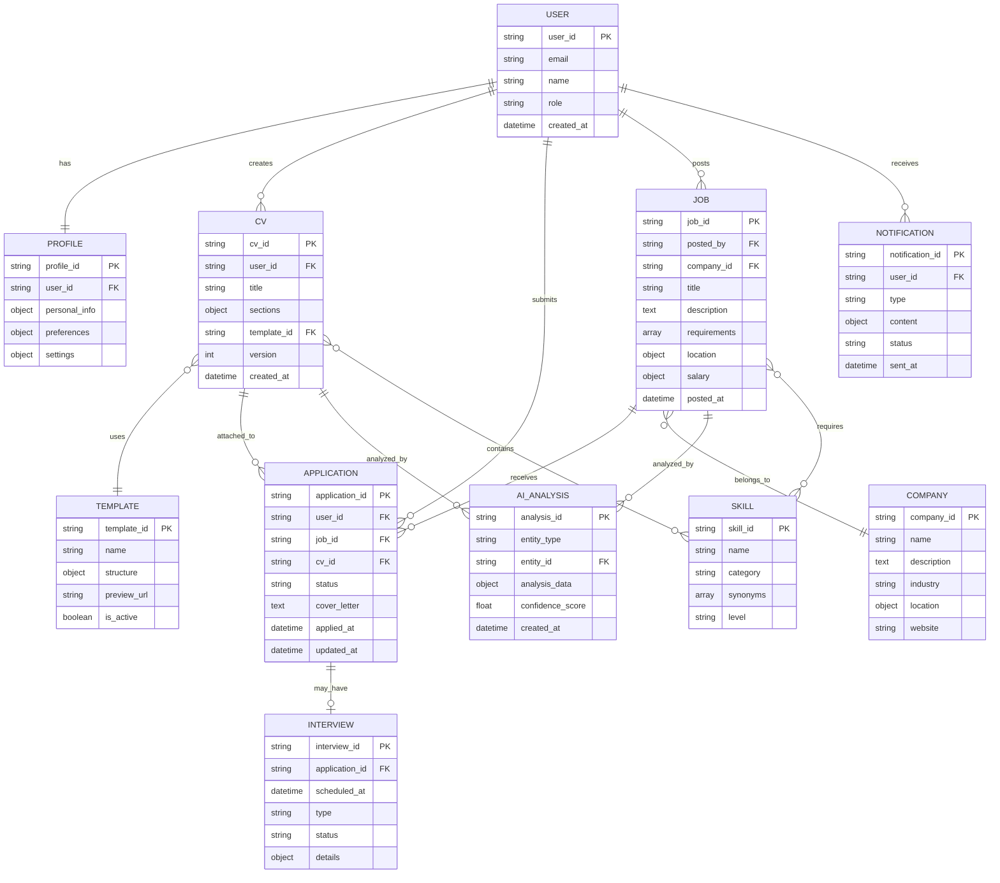
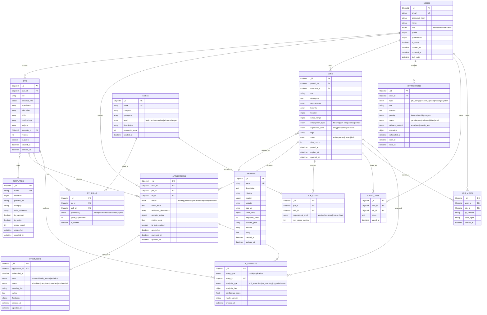

# Entity Relationship Diagrams (ERD)

## Overview

This document contains comprehensive Entity Relationship Diagrams for the AI-Powered Job Seeker Platform, showing the data model at conceptual, logical, and physical levels.

## Table of Contents
1. [Conceptual ERD](#conceptual-erd)
2. [Logical ERD](#logical-erd)
3. [Physical Database Schema](#physical-database-schema)
4. [MongoDB Collections](#mongodb-collections)
5. [PostgreSQL Analytics Schema](#postgresql-analytics-schema)
6. [Entity Descriptions](#entity-descriptions)
7. [Relationship Descriptions](#relationship-descriptions)

## Conceptual ERD

The conceptual ERD shows the high-level entities and their relationships without implementation details.



## Logical ERD

The logical ERD includes attributes, data types, and detailed relationships.



## Physical Database Schema

### MongoDB Schema (Primary Database)

```javascript
// Users Collection
{
  _id: ObjectId,
  email: { type: String, unique: true, required: true },
  password_hash: { type: String, required: true },
  name: { type: String, required: true },
  role: { type: String, enum: ['seeker', 'recruiter', 'admin'], required: true },
  profile: {
    avatar_url: String,
    phone: String,
    location: {
      city: String,
      state: String,
      country: String,
      coordinates: [Number] // [longitude, latitude]
    },
    bio: String,
    linkedin_url: String,
    github_url: String,
    portfolio_url: String
  },
  preferences: {
    job_alerts: Boolean,
    email_notifications: Boolean,
    sms_notifications: Boolean,
    preferred_locations: [String],
    salary_expectations: {
      min: Number,
      max: Number,
      currency: String
    },
    work_authorization: String,
    remote_preference: String
  },
  subscription: {
    plan: String,
    status: String,
    expires_at: Date
  },
  is_active: { type: Boolean, default: true },
  is_verified: { type: Boolean, default: false },
  created_at: { type: Date, default: Date.now },
  updated_at: { type: Date, default: Date.now },
  last_login: Date
}

// CVs Collection
{
  _id: ObjectId,
  user_id: { type: ObjectId, ref: 'User', required: true },
  title: { type: String, required: true },
  personal_info: {
    full_name: String,
    email: String,
    phone: String,
    address: String,
    linkedin: String,
    portfolio: String
  },
  summary: String,
  experience: [{
    company: String,
    position: String,
    start_date: Date,
    end_date: Date,
    is_current: Boolean,
    description: String,
    achievements: [String],
    skills_used: [String]
  }],
  education: [{
    institution: String,
    degree: String,
    field_of_study: String,
    start_date: Date,
    end_date: Date,
    gpa: Number,
    achievements: [String]
  }],
  skills: [{
    name: String,
    level: String,
    years_experience: Number,
    is_verified: Boolean
  }],
  certifications: [{
    name: String,
    issuer: String,
    issue_date: Date,
    expiry_date: Date,
    credential_id: String,
    url: String
  }],
  projects: [{
    name: String,
    description: String,
    technologies: [String],
    url: String,
    github_url: String,
    start_date: Date,
    end_date: Date
  }],
  languages: [{
    name: String,
    proficiency: String
  }],
  template_id: { type: ObjectId, ref: 'Template' },
  version: { type: Number, default: 1 },
  is_public: { type: Boolean, default: false },
  download_count: { type: Number, default: 0 },
  view_count: { type: Number, default: 0 },
  created_at: { type: Date, default: Date.now },
  updated_at: { type: Date, default: Date.now }
}

// Jobs Collection
{
  _id: ObjectId,
  posted_by: { type: ObjectId, ref: 'User', required: true },
  company_id: { type: ObjectId, ref: 'Company', required: true },
  title: { type: String, required: true },
  description: { type: String, required: true },
  requirements: [String],
  responsibilities: [String],
  benefits: [String],
  location: {
    city: String,
    state: String,
    country: String,
    coordinates: [Number],
    is_remote: Boolean,
    remote_type: String // 'fully_remote', 'hybrid', 'occasional'
  },
  salary_range: {
    min: Number,
    max: Number,
    currency: String,
    period: String // 'hourly', 'monthly', 'yearly'
  },
  employment_type: {
    type: String,
    enum: ['full-time', 'part-time', 'contract', 'temporary', 'internship']
  },
  experience_level: {
    type: String,
    enum: ['entry', 'mid', 'senior', 'executive']
  },
  skills_required: [{
    name: String,
    level: String,
    is_required: Boolean
  }],
  application_deadline: Date,
  tags: [String],
  status: {
    type: String,
    enum: ['draft', 'active', 'paused', 'closed', 'expired'],
    default: 'active'
  },
  external_source: {
    platform: String,
    external_id: String,
    url: String
  },
  view_count: { type: Number, default: 0 },
  application_count: { type: Number, default: 0 },
  posted_at: { type: Date, default: Date.now },
  expires_at: Date,
  updated_at: { type: Date, default: Date.now }
}

// Applications Collection
{
  _id: ObjectId,
  user_id: { type: ObjectId, ref: 'User', required: true },
  job_id: { type: ObjectId, ref: 'Job', required: true },
  cv_id: { type: ObjectId, ref: 'CV', required: true },
  status: {
    type: String,
    enum: ['pending', 'reviewed', 'shortlisted', 'interviewed', 'offered', 'rejected', 'withdrawn'],
    default: 'pending'
  },
  cover_letter: String,
  additional_documents: [{
    name: String,
    url: String,
    type: String
  }],
  questions_answers: [{
    question: String,
    answer: String
  }],
  recruiter_notes: [{
    note: String,
    created_by: ObjectId,
    created_at: Date
  }],
  match_score: Number,
  ai_analysis: {
    compatibility_score: Number,
    skill_match: Number,
    experience_match: Number,
    location_match: Number,
    recommendations: [String]
  },
  is_auto_applied: { type: Boolean, default: false },
  source: String, // 'platform', 'external', 'referral'
  applied_at: { type: Date, default: Date.now },
  reviewed_at: Date,
  updated_at: { type: Date, default: Date.now }
}

// Companies Collection
{
  _id: ObjectId,
  name: { type: String, required: true, unique: true },
  description: String,
  industry: String,
  location: {
    headquarters: {
      city: String,
      state: String,
      country: String
    },
    offices: [{
      city: String,
      state: String,
      country: String,
      is_headquarters: Boolean
    }]
  },
  website: String,
  logo_url: String,
  cover_image_url: String,
  social_links: {
    linkedin: String,
    twitter: String,
    facebook: String,
    instagram: String
  },
  employee_count: String,
  founded_year: Number,
  benefits: [String],
  company_culture: [String],
  rating: Number,
  review_count: Number,
  is_verified: { type: Boolean, default: false },
  created_at: { type: Date, default: Date.now },
  updated_at: { type: Date, default: Date.now }
}
```

## PostgreSQL Analytics Schema

```sql
-- User Events Table
CREATE TABLE user_events (
    id SERIAL PRIMARY KEY,
    user_id UUID NOT NULL,
    event_type VARCHAR(50) NOT NULL,
    event_data JSONB,
    session_id VARCHAR(255),
    ip_address INET,
    user_agent TEXT,
    created_at TIMESTAMP DEFAULT NOW()
);

-- Job Application Analytics
CREATE TABLE job_application_analytics (
    id SERIAL PRIMARY KEY,
    user_id UUID NOT NULL,
    job_id UUID NOT NULL,
    application_id UUID NOT NULL,
    status VARCHAR(20) NOT NULL,
    match_score DECIMAL(3,2),
    source VARCHAR(50),
    time_to_apply INTERVAL,
    applied_at TIMESTAMP DEFAULT NOW(),
    updated_at TIMESTAMP DEFAULT NOW()
);

-- CV Analytics
CREATE TABLE cv_analytics (
    id SERIAL PRIMARY KEY,
    cv_id UUID NOT NULL,
    user_id UUID NOT NULL,
    view_count INTEGER DEFAULT 0,
    download_count INTEGER DEFAULT 0,
    share_count INTEGER DEFAULT 0,
    last_updated TIMESTAMP,
    created_at TIMESTAMP DEFAULT NOW()
);

-- Job Performance Analytics
CREATE TABLE job_performance_analytics (
    id SERIAL PRIMARY KEY,
    job_id UUID NOT NULL,
    company_id UUID NOT NULL,
    view_count INTEGER DEFAULT 0,
    application_count INTEGER DEFAULT 0,
    conversion_rate DECIMAL(5,2),
    avg_time_to_apply INTERVAL,
    posted_at TIMESTAMP,
    created_at TIMESTAMP DEFAULT NOW()
);

-- AI Interaction Analytics
CREATE TABLE ai_interaction_analytics (
    id SERIAL PRIMARY KEY,
    user_id UUID NOT NULL,
    interaction_type VARCHAR(50) NOT NULL,
    query TEXT,
    response_type VARCHAR(50),
    tokens_used INTEGER,
    response_time_ms INTEGER,
    satisfaction_score INTEGER,
    created_at TIMESTAMP DEFAULT NOW()
);

-- Search Analytics
CREATE TABLE search_analytics (
    id SERIAL PRIMARY KEY,
    user_id UUID,
    search_query TEXT NOT NULL,
    filters_applied JSONB,
    results_count INTEGER,
    clicked_results INTEGER,
    search_session_id VARCHAR(255),
    created_at TIMESTAMP DEFAULT NOW()
);

-- Notification Analytics
CREATE TABLE notification_analytics (
    id SERIAL PRIMARY KEY,
    notification_id UUID NOT NULL,
    user_id UUID NOT NULL,
    type VARCHAR(50) NOT NULL,
    delivery_method VARCHAR(20) NOT NULL,
    status VARCHAR(20) NOT NULL,
    sent_at TIMESTAMP,
    delivered_at TIMESTAMP,
    opened_at TIMESTAMP,
    clicked_at TIMESTAMP
);

-- System Performance Metrics
CREATE TABLE system_metrics (
    id SERIAL PRIMARY KEY,
    metric_name VARCHAR(100) NOT NULL,
    metric_value DECIMAL(10,2) NOT NULL,
    metric_unit VARCHAR(20),
    service_name VARCHAR(50),
    recorded_at TIMESTAMP DEFAULT NOW()
);

-- Indexes for better performance
CREATE INDEX idx_user_events_user_id ON user_events(user_id);
CREATE INDEX idx_user_events_event_type ON user_events(event_type);
CREATE INDEX idx_user_events_created_at ON user_events(created_at);

CREATE INDEX idx_job_app_analytics_user_id ON job_application_analytics(user_id);
CREATE INDEX idx_job_app_analytics_job_id ON job_application_analytics(job_id);
CREATE INDEX idx_job_app_analytics_applied_at ON job_application_analytics(applied_at);

CREATE INDEX idx_search_analytics_user_id ON search_analytics(user_id);
CREATE INDEX idx_search_analytics_created_at ON search_analytics(created_at);
```

## Entity Descriptions

### Core Entities

| Entity | Purpose | Key Attributes |
|--------|---------|----------------|
| **Users** | Store user account information and profiles | email, role, preferences, profile data |
| **CVs** | Store resume/CV data with versioning | user_id, sections, template, version |
| **Jobs** | Store job postings from recruiters and external sources | title, description, requirements, company |
| **Applications** | Track job applications and their status | user_id, job_id, cv_id, status, match_score |
| **Companies** | Store company information and profiles | name, description, industry, location |

### Supporting Entities

| Entity | Purpose | Key Attributes |
|--------|---------|----------------|
| **Templates** | CV template designs and structures | name, structure, preview, category |
| **Skills** | Standardized skill definitions | name, category, synonyms, level |
| **Notifications** | System notifications and alerts | user_id, type, content, delivery_method |
| **Interviews** | Interview scheduling and management | application_id, datetime, type, status |
| **AI_Analyses** | AI analysis results and recommendations | entity_type, analysis_data, confidence |

### Analytics Entities

| Entity | Purpose | Key Attributes |
|--------|---------|----------------|
| **User_Events** | Track user interactions and behavior | user_id, event_type, session_id, timestamp |
| **Job_Performance** | Monitor job posting effectiveness | job_id, view_count, application_count, conversion |
| **Search_Analytics** | Analyze search patterns and results | query, filters, results_count, user_id |
| **AI_Interactions** | Track AI service usage and performance | interaction_type, tokens_used, response_time |

## Relationship Descriptions

### Primary Relationships

| Relationship | Type | Description |
|-------------|------|-------------|
| User → CV | One-to-Many | A user can create multiple CVs |
| User → Application | One-to-Many | A user can submit multiple applications |
| Job → Application | One-to-Many | A job can receive multiple applications |
| CV → Application | One-to-Many | A CV can be used for multiple applications |
| Company → Job | One-to-Many | A company can post multiple jobs |

### Junction Tables

| Table | Purpose | Entities Connected |
|-------|---------|-------------------|
| **CV_Skills** | Links CVs to skills with proficiency levels | CV ↔ Skills |
| **Job_Skills** | Links jobs to required skills | Job ↔ Skills |
| **Saved_Jobs** | Users' saved/bookmarked jobs | User ↔ Job |
| **Job_Views** | Track job view history | User ↔ Job |

### Constraints and Rules

#### Business Rules
1. **User Registration**: Email must be unique across all users
2. **CV Ownership**: Users can only access/modify their own CVs
3. **Job Applications**: Users cannot apply to the same job multiple times with different CVs
4. **Company Jobs**: Only recruiter users can post jobs for their companies
5. **Application Status**: Status transitions must follow defined workflow

#### Data Integrity
1. **Referential Integrity**: All foreign keys must reference valid entities
2. **Cascade Rules**: Deleting a user cascades to their CVs and applications
3. **Soft Deletes**: Important entities use soft delete (is_active flag)
4. **Audit Trail**: All modifications tracked with timestamps
5. **Version Control**: CVs maintain version history

#### Performance Considerations
1. **Indexing**: Strategic indexes on frequently queried fields
2. **Partitioning**: Large tables partitioned by date (analytics)
3. **Caching**: Frequently accessed data cached in Redis
4. **Aggregation**: Pre-calculated metrics for dashboards
5. **Archiving**: Old data archived to maintain performance

This comprehensive ERD documentation provides a complete view of the data model for the AI-Powered Job Seeker Platform, enabling proper database design, implementation, and maintenance.
