# Workflow Diagrams

## Overview

This document contains comprehensive workflow diagrams for the AI-Powered Job Seeker Platform, covering user journeys, business processes, technical workflows, and automation sequences.

## Table of Contents
1. [User Journey Workflows](#user-journey-workflows)
2. [Business Process Workflows](#business-process-workflows)
3. [Technical Process Workflows](#technical-process-workflows)
4. [n8n Automation Workflows](#n8n-automation-workflows)
5. [AI Processing Workflows](#ai-processing-workflows)
6. [Error Handling Workflows](#error-handling-workflows)

## User Journey Workflows

### 1.1 Job Seeker Registration & Onboarding

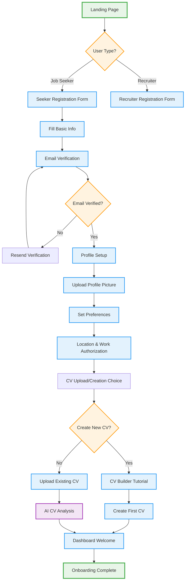

### 1.2 Job Search & Application Workflow

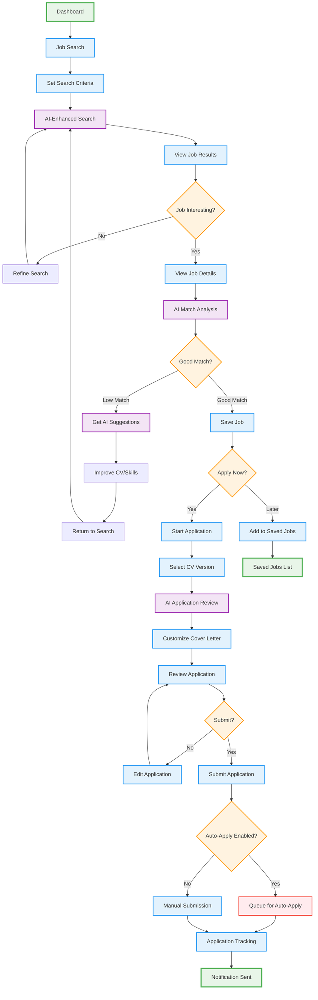

### 1.3 Recruiter Job Posting Workflow

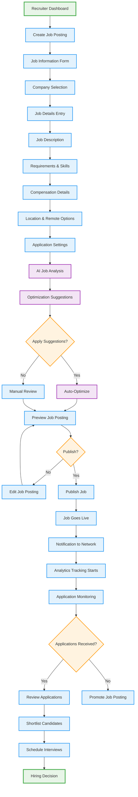

## Business Process Workflows

### 2.1 Application Review Process

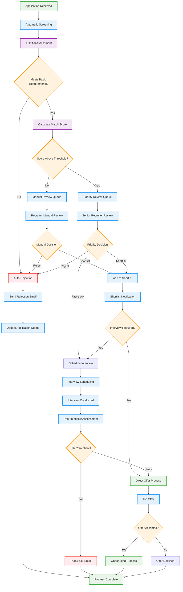

### 2.2 CV Enhancement Process

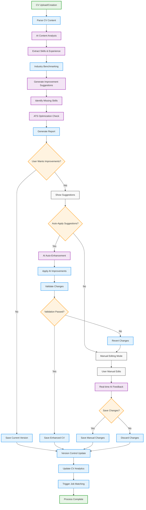

## Technical Process Workflows

### 3.1 System Authentication Flow

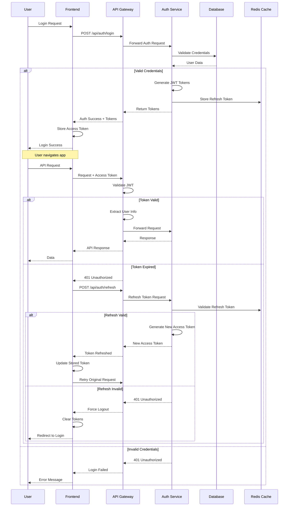

### 3.2 Job Scraping & Processing Workflow

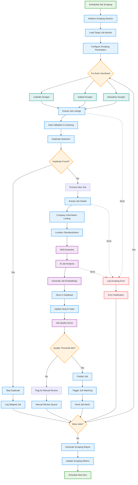

## n8n Automation Workflows

### 4.1 Auto-Apply Workflow

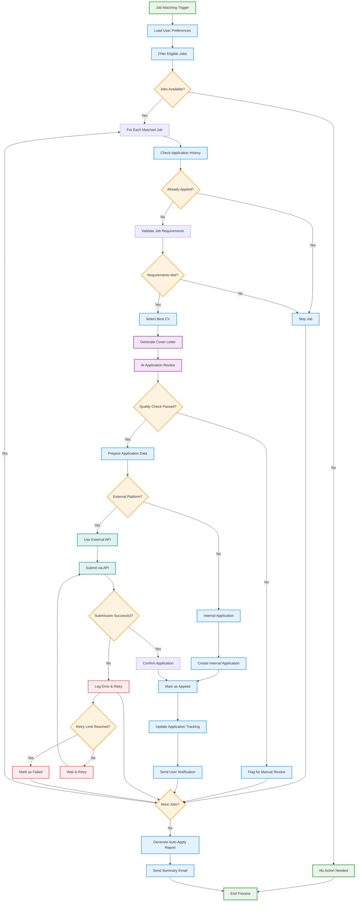

### 4.2 Notification Orchestration Workflow

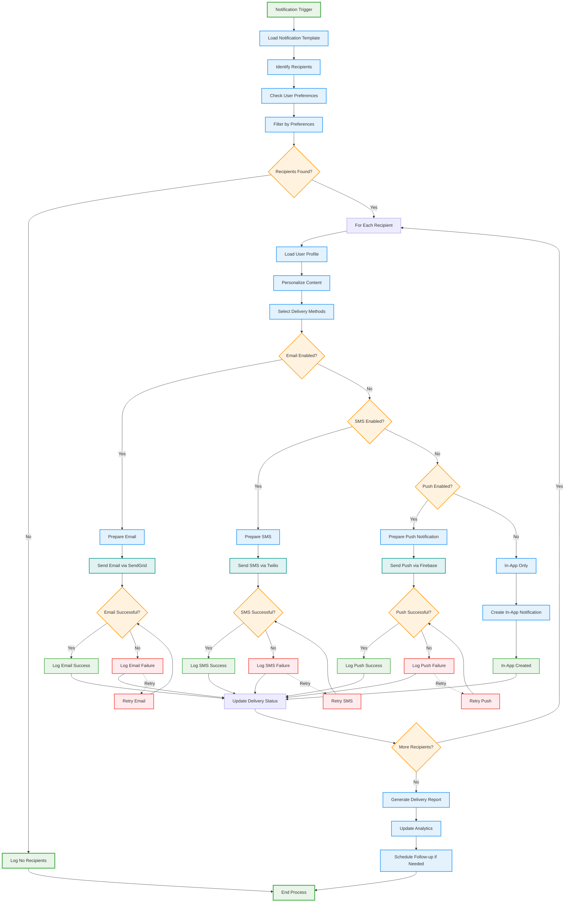

## AI Processing Workflows

### 5.1 CV Analysis & Optimization Workflow

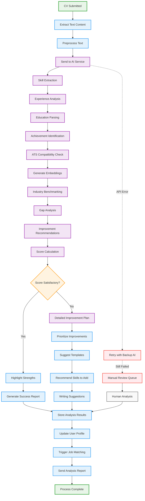

### 5.2 Job Matching Algorithm Workflow

```mermaid
flowchart TD
    A[User Profile Updated] --> B[Load User Preferences]
    B --> C[Extract User Skills]
    C --> D[Get Experience Level]
    D --> E[Load Location Preferences]
    E --> F[Get Salary Expectations]
    
    F --> G[Query Available Jobs]
    G --> H[For Each Job]
    
    H --> I[Calculate Skill Match]
    I --> J[Evaluate Experience Fit]
    J --> K[Check Location Compatibility]
    K --> L[Assess Salary Alignment]
    L --> M[Calculate Cultural Fit]
    
    M --> N[Weighted Score Calculation]
    N --> O{Score Above Threshold?}
    
    O -->|No| P[Skip Job]
    O -->|Yes| Q[Add to Candidates]
    
    P --> R{More Jobs?}
    Q --> R
    
    R -->|Yes| H
    R -->|No| S[Rank by Score]
    
    S --> T[Apply ML Model]
    T --> U[Personalization Adjustment]
    U --> V[Generate Explanations]
    V --> W[Prepare Recommendations]
    
    W --> X{Recommendations Available?}
    X -->|No| Y[Generate Fallback Suggestions]
    X -->|Yes| Z[Store Match Results]
    
    Y --> Z
    Z --> AA[Update User Feed]
    AA --> BB[Trigger Notifications]
    BB --> CC[Log Matching Event]
    CC --> DD[Process Complete]
    
    %% Machine Learning Enhancement
    S --> EE[Feature Engineering]
    EE --> FF[Model Prediction]
    FF --> GG[Confidence Scoring]
    GG --> U
    
    %% Feedback Loop
    DD --> HH[Collect User Feedback]
    HH --> II[Update ML Model]
    II --> JJ[Improve Future Matches]
    
    %% Styling
    classDef startEnd fill:#e8f5e8,stroke:#4caf50,stroke-width:3px
    classDef process fill:#e3f2fd,stroke:#2196f3,stroke-width:2px
    classDef decision fill:#fff3e0,stroke:#ff9800,stroke-width:2px
    classDef ai fill:#f3e5f5,stroke:#9c27b0,stroke-width:2px
    classDef ml fill:#e8eaf6,stroke:#3f51b5,stroke-width:2px
    
    class A,DD,JJ startEnd
    class B,C,D,E,F,G,P,S,V,W,Y,Z,AA,BB,CC process
    class H,O,R,X decision
    class I,J,K,L,M,N,Q,T,U ai
    class EE,FF,GG,HH,II ml
```

## Error Handling Workflows

### 6.1 System Error Recovery Workflow

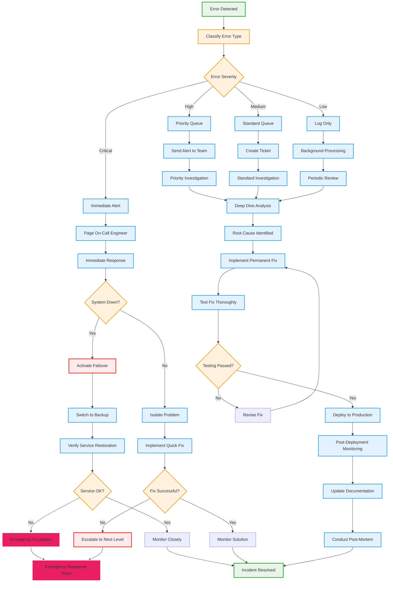

### 6.2 Data Recovery & Backup Workflow

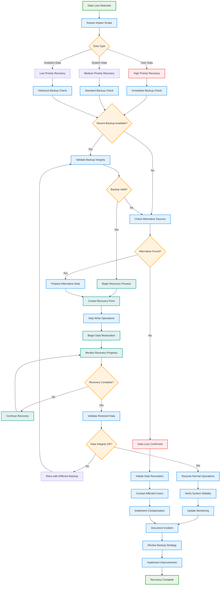

This comprehensive workflow documentation provides detailed visual guides for all major processes in the AI-Powered Job Seeker Platform, enabling better understanding of user journeys, business processes, technical implementations, and error handling procedures.
